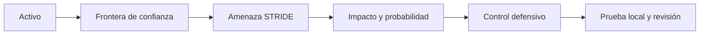

# Modelado de amenazas

## Concepto y problema

Un modelo de amenazas convierte una preocupación vaga en decisiones
verificables: qué activo importa, dónde cruza una frontera, qué capacidad se
asume para un atacante y qué control reduce el riesgo. Sin ese modelo, la
seguridad se vuelve una lista de herramientas sin justificación ni prioridad.

STRIDE ofrece un lenguaje para clasificar amenazas: suplantación, alteración,
repudio, divulgación, denegación de servicio y elevación de privilegios. No es
un escáner ni una prueba de vulnerabilidad; ayuda a formular preguntas sobre un
diseño autorizado.

## Contrato e invariantes

El modelo del crate recibe una severidad de impacto y una probabilidad
documentada, ambas de uno a cinco. Devuelve una prioridad reproducible y no
observa redes, archivos ni servicios. Un riesgo tiene contexto humano: el
número orienta una conversación, no decide por sí solo qué aceptar.

## Alternativas y decisión

Un equipo puede usar STRIDE, PASTA, árboles de ataque o una matriz propia. Para
un curso inicial, una matriz impacto-probabilidad es transparente y se prueba
fácilmente. La decisión se revisa cuando cambia el activo, la arquitectura o
la evidencia de abuso.

## Límites

Clasificar un riesgo no demuestra que exista una vulnerabilidad ni autoriza
probar un sistema. Una revisión defensiva valida controles con pruebas locales,
logs sintéticos y los permisos definidos en el contrato de laboratorio.

## Recorrido



El diagrama mantiene la decisión técnica unida a una defensa verificable. Si
no hay activo ni frontera definidos, no hay una hipótesis que probar.

## Modelo educativo

```rust
use rust_security::risk::{Priority, Risk};

let riesgo = Risk::new(5, 5);
assert_eq!(riesgo.priority(), Priority::Critical);
```

El resultado orienta orden de revisión; no reemplaza juicio humano, contexto de
negocio, costo de mitigación ni una decisión de aceptación de riesgo.

## Ejercicios y soluciones orientativas

1. **Delimita una frontera.** Un formulario recibe datos de navegador.
   Solución: la frontera está entre entrada no confiable y lógica del servidor;
   valida formato, autorización y tamaño antes de usar los datos.
2. **Prioriza una amenaza.** Un secreto aparece en logs sintéticos.
   Solución: registra impacto y probabilidad, elimina el secreto, rota datos de
   prueba y añade una prueba de redacción.
3. **Elige un control.** Solución: vincula cada riesgo a una prevención,
   detección o recuperación que pueda verificarse en el laboratorio.

## Lista de verificación

- [x] Todo riesgo declara activo y frontera de confianza.
- [x] La matriz usa una escala validada y reproducible.
- [x] La prioridad no se confunde con una prueba de vulnerabilidad.
- [x] Los ejercicios se mantienen en datos y entornos autorizados.
