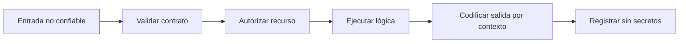

# Seguridad de aplicaciones

## Concepto y problema

Toda entrada externa es dato no confiable, aunque llegue de una interfaz propia.
La seguridad de aplicaciones empieza al definir qué formato, tamaño, contexto y
autorización acepta una operación. Rechazar datos fuera de contrato reduce
ambigüedad y evita que una capa interprete algo que otra creyó inofensivo.

## Contrato e invariantes

El modelo local valida identificadores sintéticos con una allowlist: letras
ASCII, dígitos, guion y guion bajo, entre uno y 32 caracteres. No intenta
limpiar ni reparar la entrada; una entrada fuera de contrato se rechaza. La
validación de formato no reemplaza autorización, codificación de salida ni
consultas parametrizadas.

## OWASP y defensas

Las familias OWASP recuerdan fronteras comunes: control de acceso, inyección,
configuración, autenticación, secretos y registro. La defensa se construye por
capas: validación temprana, tipos explícitos, autorización por recurso,
codificación contextual, límites de tamaño, dependencias actualizadas y logs
sin secretos.

## Límites

Este capítulo no crea payloads, no prueba aplicaciones ajenas ni automatiza
solicitudes. Los ejemplos operan sobre texto local para enseñar contratos y
pruebas de regresión defensivas.

## Recorrido



Cada flecha corresponde a una defensa distinta. Validar formato no demuestra
que el actor pueda ejecutar una acción; autorizar no vuelve segura la salida.

## Modelo educativo

```rust
use rust_security::identifier::is_safe_identifier;

assert!(is_safe_identifier("report_2026"));
assert!(!is_safe_identifier("report with spaces"));
```

La allowlist del ejemplo es un contrato deliberadamente pequeño. Un producto
define sus propios identificadores y valida Unicode, normalización y contexto
cuando esos requisitos existen.

## Ejercicios y soluciones orientativas

1. **Separa controles.** Solución: valida forma, autoriza al actor y codifica
   la salida como pasos independientes y comprobables.
2. **Limita tamaño.** Solución: define un máximo antes de almacenar o procesar
   datos; el límite evita consumo inesperado y mejora el contrato.
3. **Protege logs.** Solución: registra un identificador de correlación y un
   resultado, nunca secretos, tokens ni contenido de usuarios por defecto.

## Lista de verificación

- [x] La allowlist rechaza entradas fuera de contrato.
- [x] Validación y autorización se documentan como controles diferentes.
- [x] Los ejemplos trabajan solo con texto local.
- [x] El capítulo no contiene payloads ni interacción con objetivos reales.
