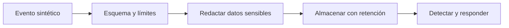

# Telemetría defensiva

## Concepto y problema

Logs, métricas y trazas ayudan a detectar fallas y abuso, pero también pueden
convertirse en una fuga si registran secretos, tokens o contenido sensible. La
telemetría defensiva diseña qué observar, cuánto retener y cómo permitir
investigación sin multiplicar el riesgo de exposición.

## Contrato e invariantes

El modelo del crate opera sobre texto sintético y redacta segmentos con prefijo
`token=`. Conserva la estructura del mensaje para depuración y sustituye el
valor por `[REDACTED]`. No analiza paquetes, no abre archivos ni identifica
secretos reales: es una demostración de una frontera de logging.

## Alternativas y límites

La redacción de texto es una capa final; la mejor defensa es no incluir
secretos en eventos. En producción se combinan esquemas de eventos, controles
de acceso, cifrado en reposo, retención limitada, alertas y respuesta a
incidentes. Un patrón de texto no sustituye clasificación de datos ni revisión
de rutas de observabilidad.

## Recorrido



## Modelo educativo

```rust
use rust_security::redaction::redact_token;

assert_eq!(redact_token("token=demo status=ok"), "token=[REDACTED] status=ok");
```

La redacción es una red de seguridad, no una licencia para registrar secretos.

## Ejercicios y soluciones orientativas

1. Define un esquema de evento con identificador de correlación y resultado.
   Solución: excluye secretos, cuerpo completo de solicitudes y credenciales.
2. Propón una alerta. Solución: mide una condición con umbral, contexto y ruta
   de respuesta; evita alertas que nadie pueda investigar.
3. Revisa retención. Solución: conserva solo lo necesario para operación y
   cumplimiento, con acceso mínimo y borrado verificable.

## Lista de verificación

- [x] Los ejemplos usan valores sintéticos y redacción local.
- [x] La telemetría no se confunde con acceso a tráfico real.
- [x] Retención, acceso y respuesta forman parte del control.
