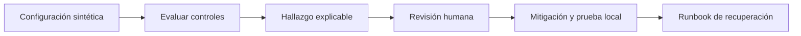

# Hardening e incidentes

## Concepto y problema

Hardening reduce superficie de ataque al elegir configuraciones explícitas,
privilegios mínimos, secretos fuera del código y actualizaciones controladas.
No es una lista estática: el control depende del activo, entorno y capacidad
operativa para detectar y recuperar.

## Contrato e invariantes

El modelo del crate evalúa una configuración sintética: exige TLS habilitado,
modo de depuración deshabilitado y acceso administrativo restringido. No cambia
configuraciones, no ejecuta comandos y no inspecciona una máquina real. El
resultado explica qué control falta para dirigir una revisión humana.

## Respuesta a incidentes

Preparar respuesta significa tener propietario, canal de comunicación, fuentes
de evidencia, criterio de contención y recuperación verificable. Ante un
evento, preservar evidencia y limitar impacto tiene prioridad sobre improvisar
acciones irreversibles. La lección del curso es diseñar ese proceso, no operar
sistemas ajenos.

## Límites

Los ejemplos no enumeran servicios, no deshabilitan controles ni elevan
privilegios. Toda evaluación se limita a estructuras locales y escenarios de
laboratorio autorizados.

## Recorrido



## Modelo educativo

```rust
use rust_security::hardening::{evaluate, Configuration};

assert!(evaluate(Configuration::new(true, false, true)).is_empty());
```

El resultado no cambia una configuración: muestra qué revisar. La decisión de
aplicar un cambio considera servicio, disponibilidad, propietario y rollback.

## Ejercicios y soluciones orientativas

1. Diseña un control de secreto. Solución: secret manager, acceso mínimo,
rotación y auditoría; nunca valores en código o logs.
2. Define un runbook. Solución: detectar, clasificar, contener, preservar
evidencia, recuperar y aprender, con responsables y comunicación explícitos.
3. Revisa privilegios. Solución: cada identidad obtiene el menor acceso útil y
se prueba su revocación en un entorno propio.

## Lista de verificación

- [x] El modelo solo evalúa estructuras locales.
- [x] Los hallazgos describen controles, no instrucciones de ataque.
- [x] Incidentes incluyen contención, evidencia y recuperación.
- [x] El capítulo conserva el alcance legal y de laboratorio.
